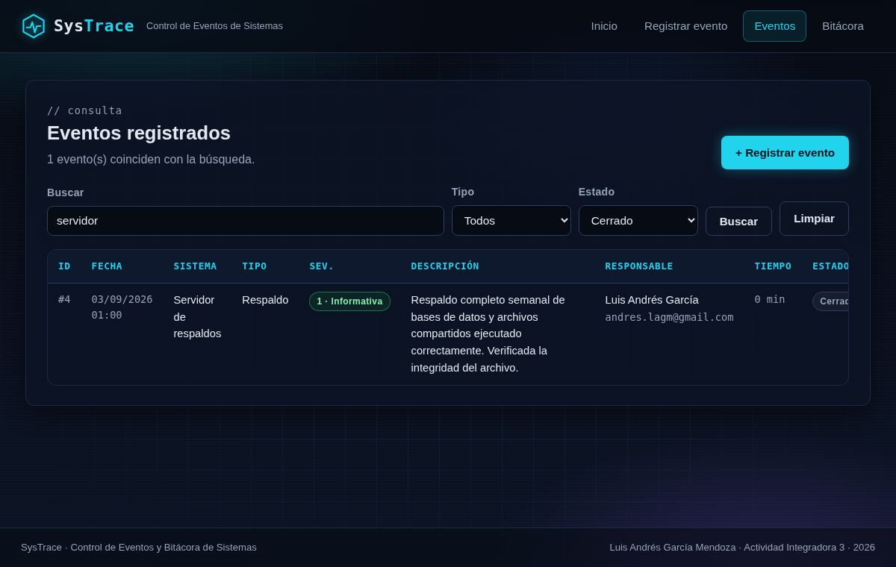

# SysTrace · Control de Eventos y Bitácora de Sistemas

**Autor:** Luis Andrés García Mendoza
**Actividad Integradora 3** · Aplicación Web con PHP, MySQL y MVC

SysTrace es una aplicación web para que un equipo de soporte o infraestructura
registre los **eventos** que ocurren en los sistemas de una organización
(incidentes, mantenimientos, alertas, cambios y respaldos) y consulte una
**bitácora** que la propia aplicación escribe de forma automática con cada
acción realizada: quién registró, consultó, buscó o eliminó, cuándo y desde
qué dirección IP.


---

## 1. Requisitos cubiertos

| Requisito de la actividad | Dónde está |
|---|---|
| Estructura MVC | `models/`, `views/`, `controllers/` y `index.php` como enrutador |
| Base de datos MySQL `integradora` con tabla principal | `sql/integradora.sql` (tablas `eventos` y `bitacora`) |
| Conexión en archivo independiente (`root`, sin clave) | `config/conexion.php` |
| Formulario de registro | `views/eventos/crear.php` |
| Validaciones con JavaScript | `js/script.js` |
| Registro mediante MVC (controlador → modelo INSERT → vista) | `EventoController::guardar()` → `Evento::insertar()` → mensaje en la vista |
| Consulta en tabla HTML | `views/eventos/listar.php` y `views/bitacora/listar.php` |
| Interfaz organizada y acorde al tema | `css/estilos.css` (CSS propio con Flexbox y Grid) |
| Código organizado en varios archivos | Un archivo por responsabilidad |
| Opcional: búsqueda y eliminación | `EventoController::buscar()` y `EventoController::eliminar()` |

---

## 2. Tecnologías utilizadas

| Capa | Tecnología | Uso en el proyecto |
|---|---|---|
| Servidor | **PHP 8** (orientado a objetos, `declare(strict_types=1)`) | Controladores, modelos y enrutador |
| Base de datos | **MySQL / MariaDB** (XAMPP) | Base `integradora` con tablas `eventos` y `bitacora` |
| Acceso a datos | **PDO** con sentencias preparadas | Modelos `Evento` y `Bitacora` |
| Estructura | **HTML5** semántico | Vistas: formularios, tablas, mensajes |
| Estilos | **CSS3** propio (variables, Flexbox, Grid, gradientes) | `css/estilos.css`, sin frameworks externos |
| Cliente | **JavaScript** (ES5, sin librerías) | Validaciones, contador de caracteres, confirmación de borrado |
| Patrón | **MVC** (Modelo · Vista · Controlador) | Separación de responsabilidades en carpetas |
| Control de versiones | **Git + GitHub** | 11 commits que evidencian el avance del proyecto |
| Entorno local | **XAMPP** (Apache + PHP + MySQL) | Ejecución en `http://localhost/` |

---

## 3. Instalación en XAMPP

1. Instala [XAMPP](https://www.apachefriends.org/) (Apache + PHP 8 + MySQL/MariaDB) y arranca **Apache** y **MySQL**.
2. Copia la carpeta `integradora/` dentro de `C:\xampp\htdocs\` (en Linux o macOS, en `htdocs/` de tu instalación).
3. Crea la base de datos importando el script:
   - **Con phpMyAdmin:** abre `http://localhost/phpmyadmin`, pestaña *Importar*, selecciona `sql/integradora.sql` y pulsa *Continuar*.
   - **Por consola:**
     ```
     C:\xampp\mysql\bin\mysql -u root < C:\xampp\htdocs\integradora\sql\integradora.sql
     ```
   El script crea la base `integradora`, las dos tablas y seis eventos de ejemplo.
4. Abre `http://localhost/integradora/` en el navegador.

La conexión usa el usuario `root` sin clave, como indica la actividad. Si tu
MySQL tiene clave, cámbiala en `config/conexion.php`.

---

## 4. Estructura del proyecto

```
integradora/
├── index.php                    Enrutador único: lista blanca de acciones -> [controlador, método]
├── config/
│   ├── conexion.php             Conexión PDO a MySQL (archivo independiente)
│   ├── catalogos.php            Tipos, estados, severidades y límites permitidos
│   └── funciones.php            Escape HTML, URLs, CSRF, mensajes flash, formato de fechas
├── controllers/
│   ├── Controlador.php          Clase base: renderizar vistas, leer campos, detectar POST
│   ├── EventoController.php     inicio, crear, guardar, listar, buscar, eliminar
│   └── BitacoraController.php   listar (solo lectura)
├── models/
│   ├── Evento.php               SQL de la tabla eventos con sentencias preparadas
│   └── Bitacora.php             SQL de la tabla bitacora (insertar y consultar)
├── views/
│   ├── layout/header.php        <head>, fondo tecnológico, barra de navegación, mensajes flash
│   ├── layout/footer.php        Pie y carga de js/script.js
│   ├── inicio.php               Panel con métricas y últimos eventos
│   ├── eventos/crear.php        Formulario de registro
│   ├── eventos/listar.php       Tabla de eventos, filtros de búsqueda y botón eliminar
│   ├── bitacora/listar.php      Tabla de auditoría
│   ├── 404.php                  Acción no encontrada
│   └── error.php                Error de base de datos (sin detalles técnicos)
├── css/estilos.css              Estilos propios
├── js/script.js                 Validaciones del formulario y confirmación de borrado
├── sql/integradora.sql          Script de la base de datos
└── docs/capturas/               Capturas de pantalla
```

### Flujo de una petición

```
Navegador ──GET/POST──▶ index.php ──▶ Controlador ──▶ Modelo ──▶ MySQL
                                          │                          │
                                          ◀── datos ─────────────────┘
                                          ▼
                                       Vista (HTML) ──▶ Navegador
```

| URL | Controlador → método | Qué hace |
|---|---|---|
| `index.php` | `EventoController::inicio` | Métricas y últimos eventos |
| `index.php?accion=crear` | `EventoController::crear` | Muestra el formulario |
| `index.php?accion=guardar` (POST) | `EventoController::guardar` | Valida, INSERT, bitácora, redirige con mensaje |
| `index.php?accion=listar` | `EventoController::listar` | Tabla de eventos + bitácora CONSULTAR |
| `index.php?accion=buscar` | `EventoController::buscar` | Filtra por texto, tipo y estado + bitácora BUSCAR |
| `index.php?accion=eliminar` (POST) | `EventoController::eliminar` | Borra con CSRF y confirmación + bitácora ELIMINAR |
| `index.php?accion=bitacora` | `BitacoraController::listar` | Tabla de auditoría |

---

## 5. Base de datos

**Tabla principal `eventos`**

| Columna | Tipo | Regla |
|---|---|---|
| `id` | INT AUTO_INCREMENT | Clave primaria |
| `sistema` | VARCHAR(60) | 3 a 60 caracteres |
| `tipo` | ENUM | Incidente, Mantenimiento, Alerta, Cambio, Respaldo |
| `severidad` | TINYINT | 1 a 5 (CHECK en la BD) |
| `descripcion` | VARCHAR(500) | 10 a 500 caracteres |
| `responsable` | VARCHAR(80) | 3 a 80 caracteres |
| `correo_responsable` | VARCHAR(120) | Correo válido |
| `tiempo_resolucion_min` | INT UNSIGNED | 0 a 10080 (CHECK en la BD) |
| `estado` | ENUM | Abierto, En proceso, Resuelto, Cerrado |
| `fecha_evento` | DATETIME | No puede ser futura |
| `creado_en` | TIMESTAMP | Automático |

**Tabla `bitacora`** (auditoría): `accion` (REGISTRAR, CONSULTAR, BUSCAR, ELIMINAR),
`evento_id` (FK con `ON DELETE SET NULL`, para que al borrar un evento el rastro
no se pierda), `detalle`, `ip_origen`, `agente` y `fecha_hora`.

---

## 6. Validaciones

**En el navegador (`js/script.js`)**, antes de enviar:

| Regla exigida | Campos |
|---|---|
| Campos vacíos | Todos los obligatorios |
| Campos numéricos | Severidad (entero 1–5), tiempo de resolución (entero 0–10080) |
| Longitud de datos | Sistema 3–60, responsable 3–80, descripción 10–500 (con contador) |
| Valores incorrectos | Tipo y estado fuera de catálogo, fecha futura, rangos |
| Correo electrónico | Correo del responsable con expresión regular |

Cada campo inválido se marca en rojo con su mensaje, se bloquea el envío y se
enfoca el primer error.


**En el servidor (`EventoController::validar`)** se repiten las mismas reglas
con `filter_var`, `mb_strlen`, `in_array` y `DateTime`, porque el JavaScript se
puede desactivar. Si algo falla, el formulario vuelve con los valores escritos
y el mensaje de cada campo.

---

## 7. Seguridad aplicada

- **Inyección SQL:** todo el acceso a datos usa PDO con sentencias preparadas y
  `PDO::ATTR_EMULATE_PREPARES = false`. La búsqueda pasa el término como
  parámetro `LIKE`, nunca concatenado.
- **XSS:** toda salida en las vistas pasa por `e()` (`htmlspecialchars` con
  `ENT_QUOTES`, UTF-8).
- **CSRF:** los formularios de registro y eliminación llevan un token de sesión
  que el controlador compara con `hash_equals`.
- **Enrutamiento seguro:** `index.php` solo acepta acciones de una lista blanca
  y devuelve 404 para cualquier otra; nunca incluye archivos a partir de la URL.
- **Borrado solo por POST:** un enlace GET no puede eliminar datos, y el
  navegador pide confirmación antes de enviar.
- **Bitácora de solo lectura:** desde la aplicación no existe forma de editar
  ni borrar la bitácora.
- **Errores controlados:** las excepciones de PDO se registran en el log del
  servidor y el usuario ve una página genérica sin la traza SQL.
- **Cabeceras:** `X-Content-Type-Options: nosniff`, `X-Frame-Options: DENY`,
  `Referrer-Policy: same-origin`.

---

## 8. Capturas

| Formulario de registro | Consulta de eventos |
|---|---|
|  |  |

| Búsqueda con filtros | Bitácora de auditoría |
|---|---|
|  |  |

---

## 9. Pruebas realizadas

- Formulario vacío, valores fuera de rango, fecha futura, correo inválido y
  descripción mayor a 500 caracteres: bloqueados por JavaScript.
- Envío directo sin JavaScript con datos inválidos: rechazado por PHP y
  formulario repoblado.
- Registro válido: aparece en la tabla, en el panel de inicio y en la bitácora
  con acción REGISTRAR, IP y navegador.
- Texto `<script>alert(1)</script>` en la descripción: se muestra como texto.
- Término `' OR 1=1 --` en la búsqueda: cero resultados, sin error.
- Eliminación por GET, sin token o con id inexistente: rechazada con mensaje.
- Eliminación válida: la fila desaparece y la bitácora conserva el rastro
  REGISTRAR original (con `evento_id` en NULL) más el nuevo rastro ELIMINAR.
- Acción desconocida en la URL: página 404 propia.
- MySQL detenido o tabla ausente: página de error genérica sin detalles SQL.
